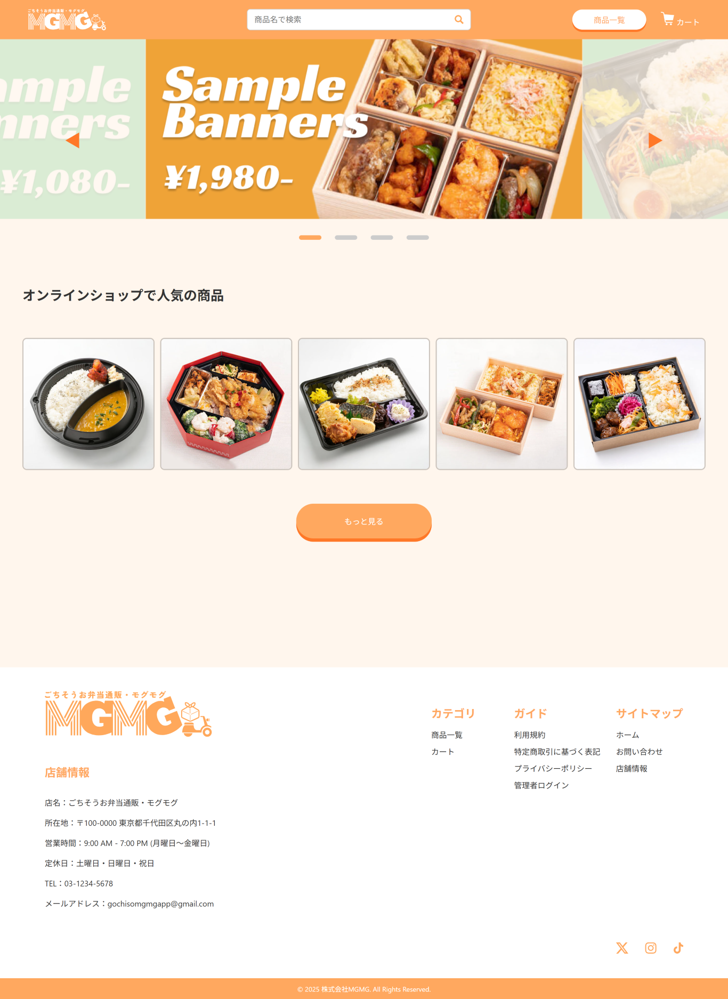

# ごちそうお弁当通販・モグモグ

「ごちそうお弁当通販・モグモグ」は、webアプリケーション演習授業の課題として制作した 
豊富なラインナップのお弁当をオンラインで注文・購入できるECサイトです。  
利用者は商品を検索・カートに追加し、注文情報を入力して購入まで完結できます。 
管理者は商品や注文情報を管理する機能を持ちます。

---

## 使用技術

- フロントエンド：HTML / CSS / JavaScript
- バックエンド：Java（Spring Boot）
- テンプレートエンジン：Thymeleaf
- データベース：PostgreSQL
- ORM：Spring Data JPA
- セキュリティ：Spring Security
- その他：GitHub（チーム開発・バージョン管理）

---

## 開発体制

- チーム人数：6名

---

## 開発期間

2025/04/17 ～ 2025/05/16（約1か月）

---

## 使い方

＜ユーザー＞ 
1.トップページまたは商品一覧から気になる商品を探す 
2.購入する商品をカートに追加 
3.カート画面で注文内容の確認（数量変更や削除が可能） 
4.購入フォームで名前・住所などの情報を入力し、注文を確定 
5.フォームに入力したメールアドレス宛に購入確認のメールが届く 
 
＜管理者＞ 
1.IDとパスワードを入力しログインする 
2.管理者ページで商品の登録・編集、注文者情報の確認 

---

## 機能一覧

| 機能カテゴリ    | 機能名            | 概要                           |
| --------- | -------------- | ---------------------------- |
| 認証        | ログイン / ログアウト   | Spring Security を利用 |
| 商品管理      | 商品一覧・詳細・検索     | カテゴリ別表示、検索フォーム対応             |
| カート管理     | カートに追加・削除・数量変更 | カートの内容を管理                    |
| 購入機能      | 購入フォーム・注文登録    | ユーザー情報入力 → 注文確定（DB保存）        |
| 注文管理（管理者） | 注文一覧表示         | 注文ごとの明細・ステータス表示              |
| 管理者機能     | 商品・注文・売上金管理    | 管理者専用画面（ログイン後アクセス可能）         |

---

## 開発を終えて

GitHubを使ったチーム制作が初めてのメンバーが多かったため、まずGitHubの使い方や注意点の共有からスタートしました。 
構築フェーズに入る前にER図・ページ遷移図・UIデザインをグラフィックデータとして作成したことで、完成イメージをチーム全員で明確に共有できました。 
その結果、認識のズレが少なくスムーズに開発を進行することができました。

